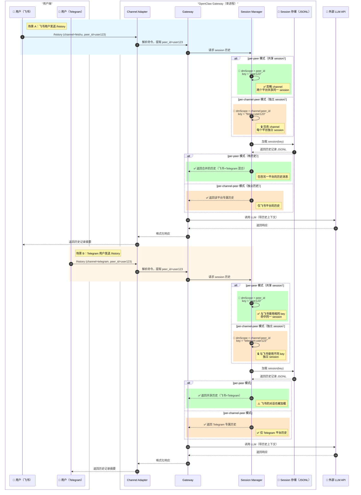
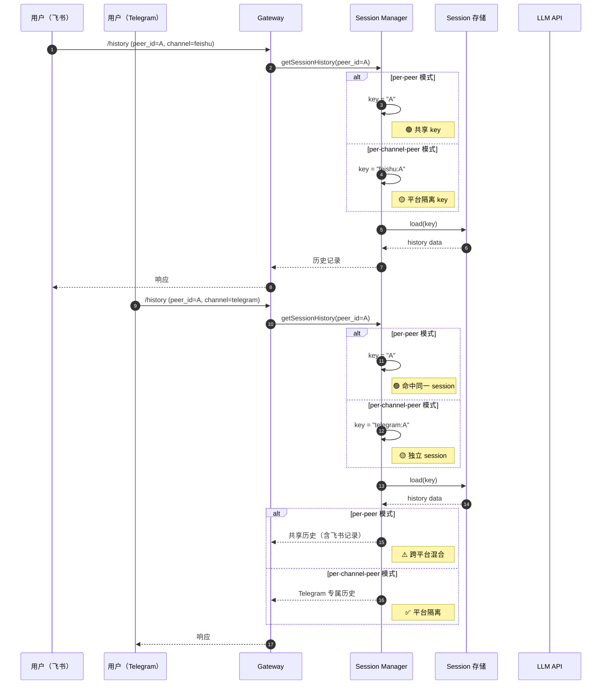

# OpenClaw `/history` 命令时序图 - 双模式对比

## 完整时序图（合并对比）



---

## 简化版时序图（核心对比）



---

## 关键差异点总结

| 维度 | per-peer 模式 | per-channel-peer 模式 |
|------|--------------|---------------------|
| **Session Key 计算** | `peer_id` | `channel:peer_id` |
| **飞书用户 key** | `user123` | `feishu:user123` |
| **Telegram 用户 key** | `user123` ✅ 相同 | `telegram:user123` ❌ 不同 |
| **历史记录** | 跨平台共享 | 平台独立隔离 |
| **上下文连贯性** | 高（但可能混乱） | 低（平台隔离） |
| **隐私性** | 低（跨平台泄露） | 高（平台隔离） |
| **适用场景** | 单平台用户 | 多平台用户 |

---

## 配置示例

```yaml
# per-peer 模式
session:
  dmScope: "peer"  # 仅按 peer_id 计算

# per-channel-peer 模式  
session:
  dmScope: "channel-peer"  # 按 channel + peer_id 计算
```

---

## 实现关键代码位置

```typescript
// Session Manager 中的 key 计算逻辑
function computeDmScope(channel: string, peerId: string, dmScope: string): string {
  switch (dmScope) {
    case 'peer':
      return peerId;  // 忽略 channel
    case 'channel-peer':
      return `${channel}:${peerId}`;  // 包含 channel
    default:
      return `${channel}:${peerId}`;
  }
}
```

---

## 视觉说明

- **🟢 绿色背景** - per-peer 模式的流程（共享 session）
- **🟡 橙色背景** - per-channel-peer 模式的流程（独立 session）
- **🔑** - Session key 计算的关键步骤
- **✅** - 优势点
- **⚠️** - 潜在问题/注意点